<h1 align="center">Hi there , I'm Gran4 (Gran<b><i>t Hur</i></b>)<h3 align="center">🔥 Passionate Software Engineer </h3></h1>

## Grant Hur | Python Developer | AI Enthusiast

Hi there! 👋 I'm Grant Hur, a Python developer on the cutting edge of using AI to boost my own productivity. Right now, I'm focused on ASDRP and improving my personal website, and some of my current work is private/internal and not open-sourced yet.

### 🤝 Let's connect

 

<strong>📬 Connect</strong>

<strong>😄 About Me </strong>

- 📍 Location: San Jose, CA, US
- 🌱 Currently working on the ASDRP iOS app and my personal website: [asdrp-website.onrender.com/resume](https://asdrp-website.onrender.com/resume)
- 🔒 Some current projects are private/internal and are not open-sourced yet
- 🧠 I know python, c, c++, iOS, and java
- 🏆 I won the 2024 1st place in Lockheed Martin's coding competition called code quest
- 💸 I won my ASDRP group personal website challenge ($20 prize) with my site: [asdrp-website.onrender.com/resume](https://asdrp-website.onrender.com/resume)
- ⚽️ I play soccer

<strong>📈GitHub Stats</strong>

<strong>Skills</strong>

<strong>🏗️ Active project(s) </strong>

#### ASDRP iOS App: Internal student platform that centralizes deadlines, attendance, forms, and profile discovery so lab communication is organized and actionable.

#### [Personal Website](https://asdrp-website.onrender.com/resume): Polished portfolio showcasing my ASDRP and personal projects with an interactive timeline, a mobile-friendly Kitchen Notes drawer, and a downloadable one-page resume in a classic format.

